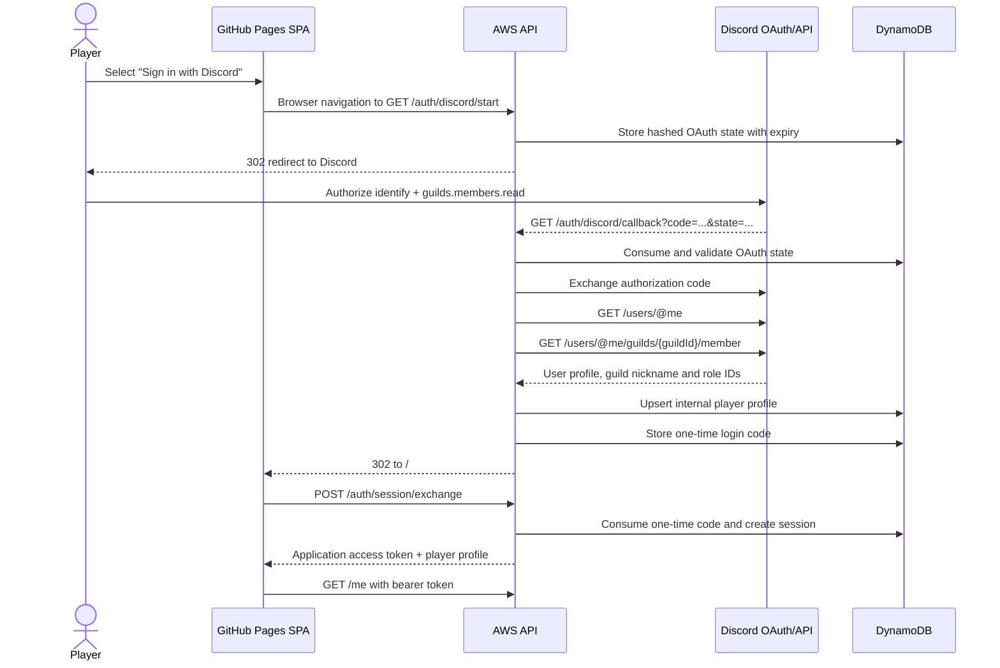
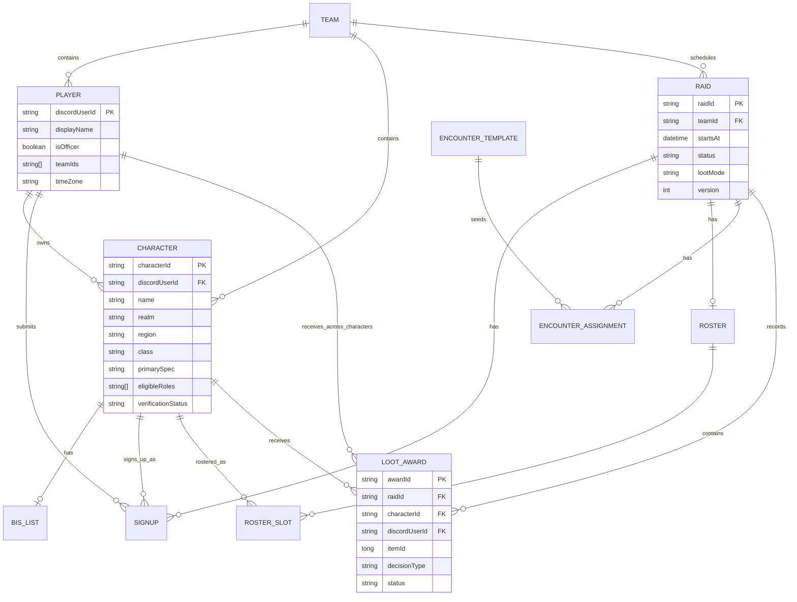
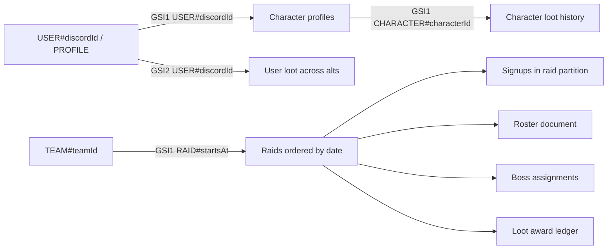

# Jasmine Dragon Raid Administration API

**Project:** Jasmine Dragon Guild Raid Administration  
**Raid teams:** Team Jasmine and Team Dragon  
**Main roster:** Team Jasmine  
**Team Jasmine default loot mode:** Loot Council  
**Backend:** AWS API Gateway HTTP API, Lambda, DynamoDB, SQS and EventBridge Scheduler

---

## 1. Answers to the frontend developer's open questions

### Can the backend tell whether a Discord user belongs to Jasmine Dragon?

Yes.

The login flow requests these Discord OAuth scopes:

```text
identify guilds.members.read
```

After Discord returns the authorization code, the backend:

1. Exchanges the code for a Discord user access token.
2. Calls Discord's current-user endpoint to get the user's stable Discord ID and profile.
3. Calls the current-user guild-member endpoint for the configured Jasmine Dragon guild ID.
4. Rejects the login if Discord says the user is not a member of that guild.

The frontend does not need to inspect a list of the user's Discord servers. Guild membership is verified by the backend before an application session is issued.

Official Discord references:

- [OAuth2 scopes](https://docs.discord.com/developers/topics/oauth2)
- [Get Current User](https://docs.discord.com/developers/resources/user#get-current-user)
- [Get Current User Guild Member](https://docs.discord.com/developers/resources/user#get-current-user-guild-member)

### Do we keep an internal users table?

Yes. A player profile is stored in DynamoDB and keyed by the stable Discord user ID:

```text
PK = USER#{discordUserId}
SK = PROFILE
```

The profile can later carry guild-specific information that Discord does not own, including:

- Team Jasmine or Team Dragon membership
- Officer status snapshot
- Time zone
- Attendance summaries
- Character ownership
- Class, spec and eligible roles through linked character records
- Professions and other later-phase profile data
- Loot history across all characters

Discord remains the identity provider. DynamoDB stores Jasmine Dragon application data.

### Do we need a public "upsert user" endpoint?

No separate frontend-driven upsert is recommended.

The backend already performs the user upsert during the Discord OAuth callback:

```text
Discord callback
  -> verify OAuth state
  -> exchange authorization code
  -> get Discord user
  -> verify Jasmine Dragon membership
  -> inspect Discord role IDs
  -> create or update USER#{discordUserId} / PROFILE
  -> create one-time application login code
  -> redirect to GitHub Pages
```

This is safer than allowing the browser to submit identity fields such as `discordUserId` or `isOfficer`. The frontend must not be trusted to assert either value.

The existing self-service profile endpoint is:

```http
PUT /players/me
```

It updates player-editable application fields after authentication. It is not responsible for creating the identity record.

### Can the backend identify officers?

Yes. Configure one or more Discord role IDs as officer roles:

```text
DISCORD_OFFICER_ROLE_IDS=role-id-1,role-id-2,role-id-3
```

During login, Discord returns the user's role IDs for Jasmine Dragon. The backend sets:

```text
isOfficer = user has at least one configured officer role ID
```

Recommended configured roles might include the actual Jasmine Dragon roles representing:

- Guild Master
- Officer
- Raid Leader
- Loot Council, only if Loot Council members should have full admin access

Use Discord **role IDs**, not role names. Names can change and are not guaranteed to be unique.

The backend is authoritative. The frontend may use `player.isOfficer` to show or hide controls, but every officer endpoint independently checks authorization.

The current application session stores the officer result for 12 hours. Role changes therefore take effect on the next login or session renewal. For the MVP this is normally acceptable. If immediate revocation becomes important, reduce session duration or re-check Discord membership and roles before sensitive operations.

### Can admins create, edit and delete raid events?

The current scaffold supports:

```http
POST /raids
PUT  /raids/{raidId}
GET  /raids/{raidId}
GET  /raids?teamId={teamId}
```

A physical `DELETE /raids/{raidId}` route is not currently implemented.

For raid history, the preferred MVP behavior is usually a **soft cancellation**:

```json
{
    "expectedVersion": 3,
    "status": "CANCELLED"
}
```

This preserves signups, roster decisions, assignments, publication history and Loot Council records. A permanent delete endpoint can be added later for empty draft raids, but completed or published raids should generally not be physically deleted.

---

## 2. Authentication flow

### 2.1 Browser login sequence



### 2.2 Important token distinction

The static frontend never receives or stores:

- Discord client secret
- Discord bot token
- Discord OAuth access token

The browser receives only the Jasmine Dragon application session token.

Authenticated requests use:

```http
Authorization: Bearer <application-session-token>
Content-Type: application/json
```

### 2.3 Login endpoint summary

| Method | Path                     |   Authentication | Purpose                                        |
| ------ | ------------------------ | ---------------: | ---------------------------------------------- |
| `GET`  | `/auth/discord/start`    |           Public | Start Discord OAuth                            |
| `GET`  | `/auth/discord/callback` | Discord callback | Validate user, guild membership and roles      |
| `POST` | `/auth/session/exchange` |    One-time code | Exchange callback code for application session |
| `POST` | `/auth/logout`           |           Player | Delete current application session             |
| `GET`  | `/me`                    |           Player | Load signed-in player and owned characters     |

### 2.4 Session exchange

Request:

```http
POST /auth/session/exchange
Content-Type: application/json
```

```json
{
    "code": "one-time-code-from-the-callback-url"
}
```

Response:

```json
{
    "data": {
        "accessToken": "opaque-application-token",
        "expiresAt": "2026-08-15T04:00:00Z",
        "player": {
            "discordUserId": "123456789012345678",
            "discordUsername": "exampleuser",
            "displayName": "JasmineMage",
            "avatarHash": "discord-avatar-hash",
            "isOfficer": true,
            "teamIds": ["team-jasmine"],
            "timeZone": "Europe/Helsinki"
        }
    }
}
```

The one-time login code is valid for five minutes and can be used once. The application session lasts 12 hours.

---

## 3. Standard response format

Success:

```json
{
    "data": {}
}
```

Error:

```json
{
    "error": {
        "code": "version_conflict",
        "message": "The record changed after it was loaded. Refresh and try again.",
        "details": null
    }
}
```

Common status codes:

|  HTTP | Meaning                                                      |
| ----: | ------------------------------------------------------------ |
| `200` | Successful read or update                                    |
| `201` | Resource created                                             |
| `202` | Asynchronous Discord publication queued                      |
| `204` | Successful action with no response body                      |
| `400` | Invalid request                                              |
| `401` | Missing, invalid or expired session                          |
| `403` | Guild membership, ownership or officer authorization failure |
| `404` | Resource not found                                           |
| `409` | Optimistic concurrency conflict                              |
| `500` | Unhandled backend failure                                    |

---

## 4. Raid teams

The MVP has two fixed teams:

| ID             | Name         | Main roster | Default loot mode |
| -------------- | ------------ | ----------: | ----------------- |
| `team-jasmine` | Team Jasmine |         Yes | `LOOT_COUNCIL`    |
| `team-dragon`  | Team Dragon  |          No | `NONE`            |

### `GET /teams`

Response:

```json
{
    "data": [
        {
            "teamId": "team-jasmine",
            "name": "Team Jasmine",
            "isMainRoster": true,
            "defaultLootMode": "LOOT_COUNCIL"
        },
        {
            "teamId": "team-dragon",
            "name": "Team Dragon",
            "isMainRoster": false,
            "defaultLootMode": "NONE"
        }
    ]
}
```

---

## 5. Phase 1 endpoint map

### 5.1 Player profiles

| Method | Path                            | Access          | Purpose                              |
| ------ | ------------------------------- | --------------- | ------------------------------------ |
| `GET`  | `/players`                      | Officer         | List internal player profiles        |
| `GET`  | `/players/me`                   | Player          | Load own profile and characters      |
| `PUT`  | `/players/me`                   | Player          | Update own display name or time zone |
| `GET`  | `/players/{discordUserId}`      | Self or officer | Load one player and characters       |
| `PUT`  | `/players/{discordUserId}`      | Officer         | Update profile and team memberships  |
| `GET`  | `/players/{discordUserId}/loot` | Self or officer | Account-wide loot across characters  |

Self-service update:

```http
PUT /players/me
```

```json
{
    "displayName": "JasmineMage",
    "timeZone": "Europe/Helsinki"
}
```

Officer update:

```http
PUT /players/123456789012345678
```

```json
{
    "displayName": "JasmineMage",
    "timeZone": "Europe/Helsinki",
    "teamIds": ["team-jasmine"]
}
```

Players cannot assign themselves to raid teams. An officer manages Team Jasmine and Team Dragon membership.

### 5.2 Characters

| Method | Path                               | Access           | Purpose                                       |
| ------ | ---------------------------------- | ---------------- | --------------------------------------------- |
| `GET`  | `/characters`                      | Officer          | List claims and roster-builder character pool |
| `GET`  | `/players/me/characters`           | Player           | List own characters                           |
| `POST` | `/players/me/characters`           | Player           | Add a character claim                         |
| `GET`  | `/characters/{characterId}`        | Player           | Load character                                |
| `PUT`  | `/characters/{characterId}`        | Owner or officer | Edit character                                |
| `POST` | `/characters/{characterId}/verify` | Officer          | Approve or reject ownership                   |
| `GET`  | `/characters/{characterId}/bis`    | Owner or officer | Read BIS list                                 |
| `PUT`  | `/characters/{characterId}/bis`    | Owner or officer | Save BIS list                                 |
| `GET`  | `/characters/{characterId}/loot`   | Player           | Character loot history                        |

Create character:

```json
{
    "name": "Teaweaver",
    "realm": "Example-Realm",
    "region": "EU",
    "characterClass": "MONK",
    "primarySpec": "MISTWEAVER",
    "eligibleRoles": ["HEALER", "DPS"],
    "teamIds": ["team-jasmine"],
    "isMain": true
}
```

New characters begin with:

```text
verificationStatus = PENDING
verificationMethod = OFFICER_APPROVAL
```

Only verified characters may be accepted into rosters or receive Loot Council awards.

### 5.3 Raids and calendar

| Method | Path                         | Access  | Purpose                           |
| ------ | ---------------------------- | ------- | --------------------------------- |
| `GET`  | `/raids?teamId=team-jasmine` | Player  | List raids for calendar/dashboard |
| `POST` | `/raids`                     | Officer | Create raid                       |
| `GET`  | `/raids/{raidId}`            | Player  | Aggregate raid details            |
| `PUT`  | `/raids/{raidId}`            | Officer | Edit or cancel raid               |

Create raid:

```json
{
    "teamId": "team-jasmine",
    "title": "Sunday Main Raid",
    "instanceName": "Example Citadel",
    "startsAt": "2026-08-16T16:00:00Z",
    "endsAt": "2026-08-16T20:00:00Z",
    "lootMode": "LOOT_COUNCIL"
}
```

Recommended status values:

```text
DRAFT
OPEN
PUBLISHED
COMPLETED
CANCELLED
```

The frontend calendar should load Team Jasmine by default and provide a Team Dragon tab or filter.

### 5.4 Signups

| Method | Path                      | Access  | Purpose                               |
| ------ | ------------------------- | ------- | ------------------------------------- |
| `PUT`  | `/raids/{raidId}/signup`  | Player  | Accept, tentatively accept or decline |
| `GET`  | `/raids/{raidId}/signups` | Officer | Load all signups for roster building  |

Request:

```json
{
    "characterId": "character-id",
    "status": "ACCEPTED",
    "note": "Can swap to healer if needed"
}
```

Allowed statuses:

```text
ACCEPTED
TENTATIVE
DECLINED
```

### 5.5 Roster

| Method | Path                     | Access  | Purpose                       |
| ------ | ------------------------ | ------- | ----------------------------- |
| `GET`  | `/raids/{raidId}/roster` | Player  | View planned roster and bench |
| `PUT`  | `/raids/{raidId}/roster` | Officer | Save roster and bench         |

```json
{
    "expectedVersion": 4,
    "roster": [
        {
            "characterId": "character-id",
            "role": "TANK",
            "group": 1,
            "position": 1,
            "note": null
        }
    ],
    "bench": []
}
```

The UI must retain the loaded `version` and send it as `expectedVersion`. A stale save returns `409 version_conflict`.

### 5.6 Encounter templates and assignments

| Method   | Path                                    | Access  | Purpose                  |
| -------- | --------------------------------------- | ------- | ------------------------ |
| `GET`    | `/templates`                            | Player  | List encounter templates |
| `POST`   | `/templates`                            | Officer | Create template          |
| `GET`    | `/templates/{templateId}`               | Player  | Read template            |
| `PUT`    | `/templates/{templateId}`               | Officer | Replace template         |
| `DELETE` | `/templates/{templateId}`               | Officer | Delete template          |
| `GET`    | `/raids/{raidId}/assignments`           | Player  | View raid assignments    |
| `PUT`    | `/raids/{raidId}/assignments/{bossKey}` | Officer | Save one boss assignment |

### 5.7 Loot Council

| Method | Path                                         | Access          | Purpose                  |
| ------ | -------------------------------------------- | --------------- | ------------------------ |
| `GET`  | `/raids/{raidId}/loot-awards`                | Player          | Raid loot history        |
| `POST` | `/raids/{raidId}/loot-awards`                | Officer         | Record award             |
| `POST` | `/raids/{raidId}/loot-awards/{awardId}/void` | Officer         | Void incorrect award     |
| `GET`  | `/characters/{characterId}/loot`             | Player          | Character history        |
| `GET`  | `/players/{discordUserId}/loot`              | Self or officer | User history across alts |

Create award:

```json
{
    "characterId": "character-id",
    "itemId": 12345,
    "itemName": "Staff of the Jasmine Dragon",
    "itemLevel": 999,
    "slot": "MAIN_HAND",
    "decisionType": "MAIN_SPEC",
    "priority": "BIS",
    "note": "Largest upgrade"
}
```

The backend derives the owning Discord user from the character. It snapshots BIS status at award time and keeps the award as an auditable history record.

### 5.8 Publishing

| Method | Path                      | Access  | Purpose                                    |
| ------ | ------------------------- | ------- | ------------------------------------------ |
| `POST` | `/raids/{raidId}/publish` | Officer | Queue Discord raid post and assignment DMs |

Response:

```json
{
    "data": {
        "raidId": "raid-id",
        "publishVersion": 4,
        "queuedAssignmentDms": 24
    }
}
```

The response is `202 Accepted`. The frontend should show that publication was queued rather than wait for every Discord API call.

---

## 6. Conceptual application relationships

This diagram describes the domain model rather than DynamoDB's physical storage format.



---

## 7. DynamoDB physical records

The single table uses:

```text
PK
SK
EntityType
Version
Data
UpdatedAt
ExpiresAt       optional TTL
GSI1PK / GSI1SK
GSI2PK / GSI2SK
```

### 7.1 Canonical records

| Entity                  | PK                        | SK                           |
| ----------------------- | ------------------------- | ---------------------------- |
| Player profile          | `USER#{discordUserId}`    | `PROFILE`                    |
| Character               | `CHARACTER#{characterId}` | `PROFILE`                    |
| BIS list                | `CHARACTER#{characterId}` | `BIS`                        |
| Raid                    | `RAID#{raidId}`           | `META`                       |
| Signup                  | `RAID#{raidId}`           | `SIGNUP#{discordUserId}`     |
| Roster                  | `RAID#{raidId}`           | `ROSTER`                     |
| Boss assignment         | `RAID#{raidId}`           | `ASSIGNMENT#{bossKey}`       |
| Loot award              | `RAID#{raidId}`           | `LOOT#{awardedAt}#{awardId}` |
| Encounter template      | `GUILD#{discordGuildId}`  | `TEMPLATE#{templateId}`      |
| OAuth state             | `OAUTHSTATE#{sha256}`     | `STATE`                      |
| One-time login code     | `LOGINCODE#{sha256}`      | `CODE`                       |
| Session                 | `SESSION#{sha256}`        | `SESSION`                    |
| Reminder marker         | `RAID#{raidId}`           | `REMINDER#{type}...`         |
| Discord delivery marker | `DELIVERY#{sha256}`       | `DELIVERY`                   |

### 7.2 Main access patterns



### 7.3 Why Discord ID is stored on loot awards

A loot award stores both:

```text
characterId
discordUserId
```

This intentionally duplicates the character-owner relationship so the system can efficiently show:

- Awards for one raid
- Awards for one character
- Awards for one Discord user across all mains and alts

It also preserves the historical recipient even if character metadata changes later.

---

## 8. Frontend implementation order

### Milestone 1: Discord authentication

1. Add a **Sign in with Discord** button.
2. Navigate the browser to `GET /auth/discord/start`.
3. Implement the hash route `/#/auth/callback`.
4. Read `code` or `error` from the hash route query string.
5. Exchange the one-time code through `POST /auth/session/exchange`.
6. Store the returned application token in `sessionStorage`.
7. Remove the one-time code from the address bar.
8. Load `GET /me`.
9. On `401`, clear the session and show the login screen.

Example:

```ts
window.location.assign(`${API_BASE_URL}/auth/discord/start`);
```

```ts
const response = await fetch(`${API_BASE_URL}/auth/session/exchange`, {
    method: "POST",
    headers: { "Content-Type": "application/json" },
    body: JSON.stringify({ code }),
});

const body = await response.json();
sessionStorage.setItem("jd_access_token", body.data.accessToken);
history.replaceState(null, "", `${location.pathname}#/`);
```

### Milestone 2: Dashboard and calendar

After login, load in parallel:

```http
GET /me
GET /teams
GET /raids?teamId=team-jasmine
```

Show:

- Upcoming Team Jasmine raids by default
- Team Dragon as a selectable tab/filter
- Player signup status
- Published roster and bench
- Officer create/edit controls when `player.isOfficer` is true

### Milestone 3: Internal profiles and character claims

Implement:

- My profile
- My characters
- Officer player directory
- Team assignment
- Character verification queue

### Milestone 4: Roster builder

Implement:

- Signed-up character pool
- Drag to roster or bench
- Role, group, position and note
- Version-conflict handling

### Milestone 5: Assignments and publishing

Implement reusable templates, boss assignments and the asynchronous publish action.

### Milestone 6: Loot Council

For Team Jasmine raids with `lootMode = LOOT_COUNCIL`, show:

- Award entry form
- Raid award history
- Character history
- User history across alts
- Void action for mistakes

---

## 9. Frontend authorization rules

The frontend may use `isOfficer` for presentation, but not security.

| Operation                             | Player | Officer |
| ------------------------------------- | -----: | ------: |
| View raids                            |    Yes |     Yes |
| Sign up                               |    Yes |     Yes |
| Edit own profile                      |    Yes |     Yes |
| Add own character                     |    Yes |     Yes |
| Edit another player's team membership |     No |     Yes |
| Verify character                      |     No |     Yes |
| Create/edit/cancel raid               |     No |     Yes |
| Edit roster                           |     No |     Yes |
| Edit assignments/templates            |     No |     Yes |
| Record or void LC award               |     No |     Yes |
| Publish Discord post and DMs          |     No |     Yes |

Every restricted API route performs its own backend check.

---

## 10. Known MVP decisions and gaps

### Already handled

- Discord identity
- Jasmine Dragon guild membership verification
- Officer detection through configured Discord role IDs
- Internal player profile upsert during OAuth callback
- Team Jasmine and Team Dragon
- Character ownership claims and officer verification
- Raid creation/editing and signups
- Roster and assignment versioning
- Team Jasmine Loot Council history
- Discord publish queue and reminder worker

### Intentionally not implemented as a separate API

- Public `upsert user` endpoint
- Frontend-supplied officer flag
- Frontend-supplied Discord user ID during login

### Current gaps or follow-up decisions

1. **Permanent raid deletion:** use `status = CANCELLED` for now; add physical deletion only for safe draft cleanup if needed.
2. **Immediate officer-role revocation:** current role status lasts for the application session.
3. **Automated WoW character ownership:** current MVP uses officer approval.
4. **Attendance summaries:** the player record can be extended, but attendance calculation is not yet implemented.
5. **Professions and gear snapshots:** appropriate future profile/character entities, not authentication concerns.
6. **Discord delivery-status UI:** publishing is queued, but the current API does not expose a per-message delivery dashboard.

---

## 12. Recommended answer to the frontend developer

> Discord authentication should indeed be the first focus. The backend can directly verify that the authenticated user belongs to Jasmine Dragon by requesting Discord's `guilds.members.read` scope and reading that user's guild-member record for our configured server ID. The same response includes their Discord role IDs, so officer status can be derived from a configured list of officer-role IDs.
>
> We do want an internal player profile keyed by Discord user ID. However, the frontend does not need to call a separate public upsert endpoint after login. The backend OAuth callback verifies membership and roles and then creates or updates the internal player record before redirecting back to the GitHub Pages application. The frontend only exchanges the returned one-time code for our own application session and calls `GET /me`.
>
> The dashboard can then load Team Jasmine raids by default, with Team Dragon as a second view. Players can sign up and view the planned roster; officers can create and edit raids. For deletion, the current MVP should mark raids `CANCELLED` so that signups, assignments and Loot Council history are not lost.
>
> The API documentation includes both a conceptual relationship diagram and the physical single-table DynamoDB key structure. Player profiles, characters, raids, signups, rosters, assignments, BIS lists and loot awards are separate logical records connected through Discord user IDs, character IDs, raid IDs and team IDs.
